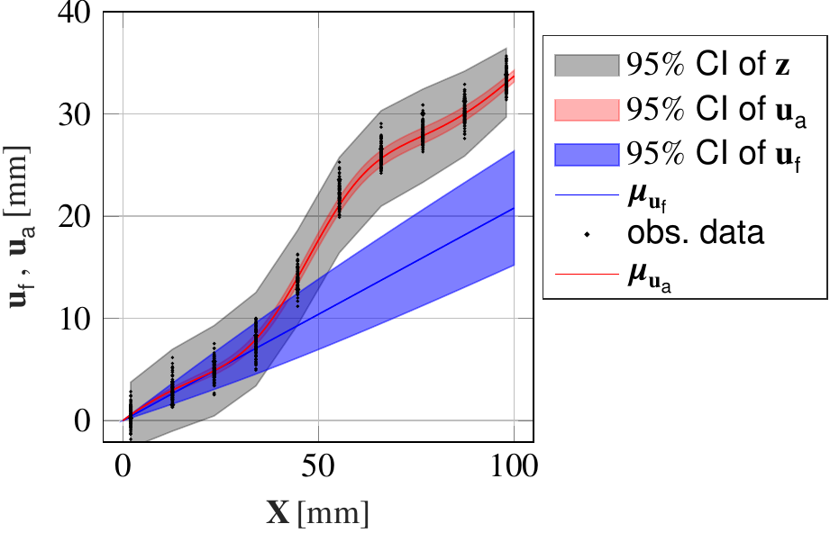
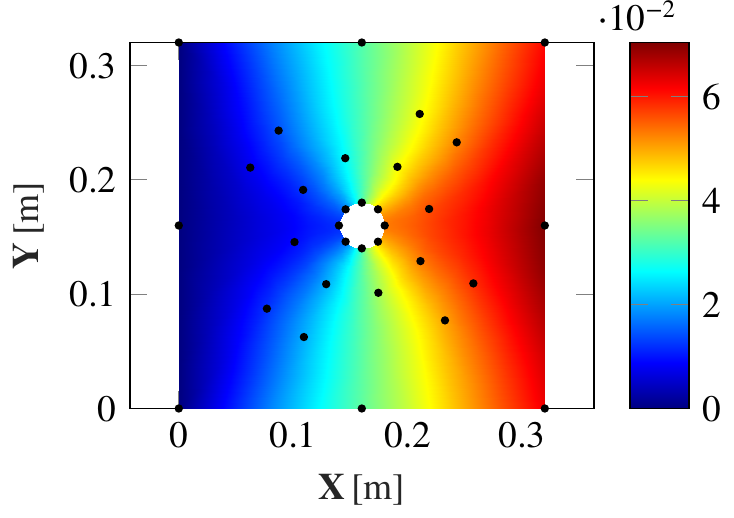

# PC-Based-statFEM 

[](LICENSE)

## 📄 Overview
`PC-Based-statFEM` The project implements a Gauss-Markov-Kálmán Filter (GMKF)-based approach for the statFEM framework. Both the prior and posterior displacements are represented using Polynomial Chaos (PC) expansions, and the model-reality mismatch is modeled as a non-stationary random field through a Karhunen-Loève (KL) expansion.  

## 📚 Related Publication
This codebase supports research from the following paper:  
> **Narouie, V., et al.** (2024). *Mechanical State Estimation with a Polynomial-Chaos-Based Statistical Finite Element Method*  
> Available on [arxiv.org/abs/2412.05037](https://arxiv.org/abs/2412.05037)

## 🖥️ Installation
1. **Clone the repository:**
   ```bash
   git clone https://github.com/VhI3/PC-Based-statFEM.git
   cd PC-Based-statFEM
   ```

2. **Requirements:**
   - MATLAB R2020b or newer
   - Optimization Toolbox (for `fminunc`)
   - Statistics and Machine Learning Toolbox (for random number generation)

3. **Add library paths in MATLAB:**
   ```matlab
   addpath(genpath('lib'));
   ```

---

## 📝 Usage
1. **Run the main script for 1D:**
   ```matlab
   ./src/tensionBar/main_tensionBar.m
   ```
2. **Run the main script for 2D:**
   ```matlab
   ./src/infinitePlate/main_infinitePlate.m
   ```
---

## 📊 Example Results
<p align="center">
  
  
  
</p>

---

## 📂 Repository Structure
```
PC-Based-statFEM/
├── figures/                       # Output figures and visualizations generated by simulations
│   └── *.png                      # Plots 
│
├── lib/                           # Core numerical libraries and utility functions
│   ├── fill_between.m             # Plotting utility to fill areas between curves
│   ├── funcall.m                  # Helper function
│   ├── gauss_hermite_rule.m       # Gaussian-Hermite quadrature rule implementation
│   ├── Gauss_int.m                # Gaussian integration utilities
│   ├── hermite.m                  # Hermite polynomial computations
│   ├── Hermite_PC.m               # Hermite Polynomial Chaos expansion
│   ├── Hermite_PC_d.m             # Hermite PC expansions for model-reality mismatch
│   ├── Hermite_PC_e.m             # Hermite PC expansions for noise
│   ├── H_projection.m             # Projection matrix 
│   ├── inv2.m                     # Efficient inversion
│   ├── Jacobian1D.m               # Jacobian calculations for 1D FEM elements
│   ├── Jacobian2D.m               # Jacobian calculations for 2D FEM elements
│   ├── KL_fredholm_Galerkin_local_1D.m     # 1D KL expansion solver using Fredholm integral equations
│   ├── KL_fredholm_Galerkin_local_2D_optimized.m # Optimized 2D KL expansion solver
│   ├── KL_Sensor_Galerkin_local_d.m       # KL expansions for model-reality 
│   ├── Lagrange1D.m               # 1D Lagrange shape functions for FEM
│   ├── Lagrange2D.m               # 2D Lagrange shape functions for FEM
│   ├── Lagrange2D_d.m             # Derivatives of 2D Lagrange shape functions
│   ├── lagrange_func.m            # Lagrange polynomial utility functions
│   ├── lagrange_func_d.m          # Derivative computations for Lagrange polynomials
│   ├── multi_index.m              # Multi-index generation for PC expansions
│   ├── multiindex.m               # Alternative multi-index
│   ├── smolyak_grid.m             # Smolyak sparse grid generation for high-dimensional integration
│   └── tensor_mesh.m              # Tensor product mesh generation utilities
│
├── src/                           # Source code for example simulations
│   ├── infinitePlate/             # 2D plate with a hole simulation examples
│   │   ├── BVP_nsen11_nred11.mat  # Precomputed results with 11 sensors and 11 number or readings 
│   │   ├── BVP_nsen32_nred11.mat  # Precomputed results with 32 sensors and 11 number or readings
│   │   ├── BVP_nsen112_nred11.mat # Precomputed results with 112 sensors and 11 number or readings
│   │   ├── FEM_plateWithHole_Solver.m         # FEM solver for the plate with hole problem
│   │   ├── globalstiffness_hyper2.m          # Hyperelastic material stiffness matrix computation
│   │   ├── globalstiffness_linearElastic2D.m # Linear elastic material stiffness matrix computation
│   │   ├── main_infinitePlate.m              # Main driver script for the 2D plate simulation
│   │   ├── makeSurf.m                        # Surface plotting utility for displacement fields
│   │   ├── pk2cauchy.m                       # Conversion of PK2 stresses to Cauchy stresses
│   │   ├── plateWithHole_extended_PC.m      # PC expansion for extended analysis
│   │   ├── plateWithHole_FEM_preprocess.m   # Preprocessing for FEM inputs
│   │   ├── plateWithHole_FEM_processLE.m    # Linear elastic FEM solver
│   │   ├── plateWithHole_FEM_processLE_KL_Expansion.m # KL expansion integration for linear elasticity
│   │   ├── plateWithHole_FEM_processNH.m    # Hyperelastic FEM solver
│   │   ├── plateWithHole_FEM_surfplotV2.m   # Advanced surface plot generation
│   │   ├── plateWithHole_H_matrix.m         # H matrix computation
│   │   ├── plateWithHole_hyperParameter.m   # Hyperparameter definition for inference
│   │   ├── plate_with_hole_Mesh.m           # Mesh generation for the 2D plate domain
│   │   ├── plateWithHole_obs_generate.m     # Synthetic observation data generator
│   │   ├── plateWithHole_SSFEM_process_LE_PC_Expansion.m # Stochastic FEM with PC expansions
│   │   ├── plateWithHole_statFEM_modelReality_KL_Expansion.m # Model-reality mismatch via KL expansions
│   │   ├── plateWithHole_statFEM_Noise_PC_Expansion.m       # Noise modeling using PC expansions
│   │   ├── plateWithHole_statFEM_norm.m     # Norm calculation for displacement errors
│   │   ├── plateWithHole_statFEM_PC_update.m# Posterior update for PC coefficients
│   │   ├── quadsCheck.m                     # Quality check of quadrilateral mesh elements
│   │   ├── sensor_nsen11.m                  # Sensor layout for 11 sensors
│   │   ├── sensor_nsen32.m                  # Sensor layout for 32 sensors
│   │   ├── sensor_nsen112.m                 # Sensor layout for 112 sensors
│   │   └── square_plate_with_hole2.geo      # Geometry file for Gmsh mesh generation
│
│   └── tensionBar/              # 1D tension bar simulation examples
│       ├── FEM_1DBar_Tipload_Solver.m      # FEM solver for the tension bar problem
│       ├── main_tensionBar.m              # Main script to execute tension bar simulations
│       ├── mean_yObs_ld10_1000.mat        # Observation data (l_d =  10)
│       ├── mean_yObs_ld25_1000.mat        # Observation data (l_d  = 25)
│       ├── mean_yObs_ld50_1000.mat        # Observation data (l_d = 50)
│       ├── mean_yObs_ld100_1000.mat       # Observation data (l_d =  100)
│       ├── tensionBar_extended_PC.m       # Extended PC expansions for tension bar analysis
│       ├── tensionBar_FEM_preprocess.m    # Preprocessing for tension bar FEM analysis
│       ├── tensionBar_FEM_preprocess_KL_Expansion.m # KL expansions for model error representation
│       ├── tensionBar_FEM_process_LE.m    # Linear elastic FEM solver for the tension bar
│       ├── tensionBar_H_matrix.m          # H matrix computation for posterior updates
│       ├── tensionBar_hyperParameter.m    # Hyperparameter configuration
│       ├── tensionBar_obs_generate.m      # Observation data generation scripts
│       ├── tensionBar_plot.m              # Visualization utilities for tension bar results
│       ├── tensionBar_RMSD_nr.m           # Root Mean Square Deviation analysis
│       ├── tensionBar_RMSD_nr_v2.m        # Updated RMSD analysis with additional metrics
│       ├── tensionBar_SSFEM_process_LE_PC_Expansion.m # Stochastic FEM with PC expansions
│       ├── tensionBar_statFEM_modelReality_KL_Expansion_converge.m # KL-based convergence study
│       ├── tensionBar_statFEM_PC_update.m # Posterior updates using PC coefficients
│       ├── tensorBar_statFEM_Noise_PC_Expansion.m # Noise modeling in statFEM framework
│       └── yObs.mat                       # Synthetic observation data file
│
└── README.md                              # Project overview
```

---

## 🛡️ License
This project is licensed under the [GNU General Public License v3.0 (GPL-3.0)](LICENSE).  
Feel free to use, modify, and distribute under the terms of the GPL.

---

## 🙌 Acknowledgments
- Developed at **TU-Braunschweig**.
- Special thanks to the research team and community contributors.
